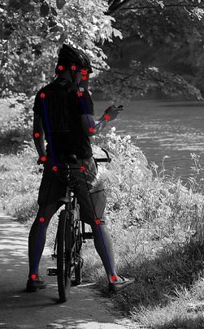

# 一、模型说明
该部署代码用于姿态检测任务，基于PaddleDetection2.5进行模型训练，paddle版本使用2.4.0

# 二、效果预览
可视化结果:



# 三、使用方式
## 3.1 模型训练
__模型生产基于aistudio平台进行__，确保已有aistudio账号。

### 3.1.1 环境准备

aistudio创建项目, 选择paddle2.4.0版本。

### 3.1.2 模型训练、评估、导出
模型生产过程请参考项目：[aistudio项目链接](https://aistudio.baidu.com/projectdetail/7161083?contributionType=1&sUid=1318783&shared=1&ts=1701160332830)

__请参考如下版本__：

模型训练完成得到model.pdmodel和mode.pdiparams模型文件。

## 3.2 模型转换

### 3.2.1 已转换模型
本项目已转换好使用coco数据集训练的Hrnet模型，置于model文件夹内供使用。
### 3.2.2 其他模型
若需要转换其他自行训练的模型，请联系百度技术支持同学：ext_edgeboard01@baidu.com

## 3.3 运行模型推理示例代码
__模型部署基于板卡进行__             

首先安装依赖库，确保当前位于/home/edgeboard/hrnet-python目录下：
```bash
sudo pip install -r requirements.txt -i https://pypi.tuna.tsinghua.edu.cn/simple
```
## 3.3.1 ppnc推理
- 首先将模型转换阶段产生的model.nb、model.json模型文件传输至板卡，置于/home/edgeboar/hrnet-python/model文件夹
- 修改models文件夹下的config.json,如下：
    ```json
    {
        "mode": "professional",
        "model_dir": "./models", 
        "model_file": "model"        
    }
    ```
    - mode: 固定为"professional"
    - model_dir：传输至板卡的model.nb、model.json模型文件的目录
    - model_file: 模型文件名，固定为model

- 运行推理脚本
    确保当前位于/home/edgeboar/hrnet-python目录下：

    ```shell
    sudo python3 tools/infer_demo.py \
            --config ./model/config.json \
            --infer_yml ./model/infer_cfg.yml \
            --test_image test_images/0.jpeg \
            --visualize \
            --with_profile
    ```

    命令行选项参数如下：

        - config: 上文建立的config.json路径
        - infer_yml: Detection套件模型导出所带的yml文件
        - test_image: 测试图片路径
        - visualize: 是否可视化，若置为True，则会在该路径下生成vis.jpg渲染结果
        - with_profile: 是否统计前处理、模型推理、后处理各阶段耗时，若置为True，会输出各阶段耗时

## 3.3.2 paddle、ppnc对比测试
- 模型文件 
    首先将模型生产阶段产生的xx.pdmodel，xx.pdiparams模型文件传输至板卡，置于./model文件夹

- 执行测试

    确保当前位于/home/edgeboard/hrnet-python目录下：

    ```shell
    sudo python3 tools/test.py \
    --config  ./model/config.json  \
    --infer_yml ./model/infer_cfg.yml  \
    --model_dir ./model \
    --test_dir ./test_images \
    --output_dir ./output_dir
    ```

        各命令行选项参数如下：
        - config: 同上
        - infer_yml: 模型导出时生成的infer_cfg.yml文件
        - model_dir: paddle静态图模型文件(model.pdmodel)和(model.pdiparams)所在目录
        - test_dir: 测试图片文件夹路径
        - output_dir: 存放结果文件，默认为"./output_dir"，该路径下会生成paddle_result_pickle、paddle_result_images、ppnc_result_pickle、ppnc_result_images目录，分别存放paddle和ppnc的pickle格式结果和可视化的结果数据。

## 3.3.3 实际项目部署
实际用于项目中时，仅需要部分脚本，因此需要提取部署包并置于实际的项目代码中运行。

### 3.3.3.1 提取部署包
确保当前位于/home/edgeboard/hrnet-python, 执行以下命令导出用于项目部署的zip包：
```shell
sudo ./extract.sh
```
执行成功后会在当前目录生成hrnet_deploy.zip压缩包。

### 3.3.3.2 使用部署包
- 准备ppnc模型及配置文件  
    将模型转换阶段生成的model.nb、model.json模型文件拷贝到项目能访问的目录，并参照3.3.1的方式编写模型配置文件config.json。

- 准备环境   
    将3.3.3.1生成的hrnet_deploy.zip部署包解压后得到hrnet文件夹和requirements.txt文件。其中requirements.txt是已验证过部署包可正常使用的相关库版本，实际项目开发中安装相关库时可参考该文件。
- 使用   
    部署包使用方式请参考[3.3.1-ppnc推理]中使用的infer_demo.py脚本

